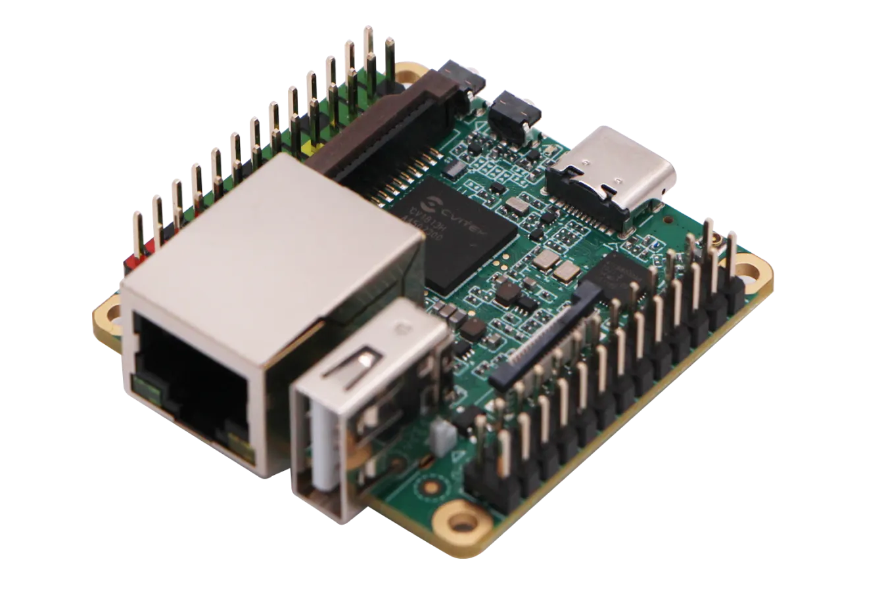

# Milk-V Duo S Alpine Linux (aarch64)

A setup script that replaces the default Buildroot Linux distribution on the Milk-V Duo S with Alpine Linux 3.22 while preserving all hardware-specific functionality.



## What this project does

This setup script (`setup.sh`) automatically:

1. **Create Alpine Linux with:**
   - OpenRC init system
   - Auto-login as root (password: `milkv`)
   - SSH access via Dropbear
   - WiFi support with wpa_supplicant
   - Network configuration for Ethernet and WiFi
   - Hardware initialization scripts

2. **Creates a ready-to-use image:**
   - Output: `milkv-duos-alpine-aarch64-sd_v2.0.1.img`
   - Can be flashed directly to SD card

## Usage

```bash
./setup.sh
```

or just flash your sd card with the image.

Tested on ubuntu 24.04 (aarch64 multipass VM)

## Result

You'll have a Milk-V Duo S running Alpine Linux with all original hardware features intact, plus the benefits of using Alpine Linux.

## TODO

- Increase the amount of memory (currently ~300MB available instead of 512MB)
